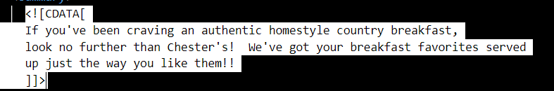
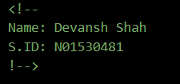
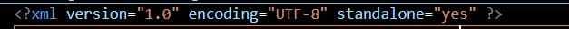
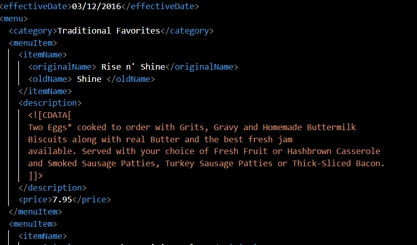
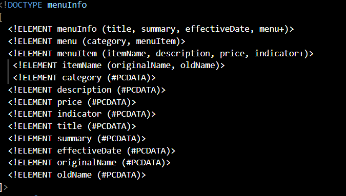
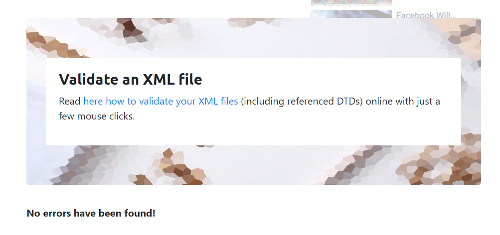
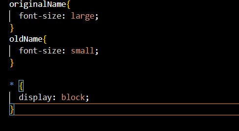

1. Open `module-2/assignments/assignment.xml` in your browser. Are there any errors? Explain the error and fix it.
Ans1: There is an error in assignment.xml file on line 27.
there is a space in the element name.According the rules element name can not contain any space.

2. What is the use of CDATA block in this document?
Ans2: In this document the CDATA block is used to provide the summary and the description of the main items of 
Chester's Breakfast Menu. For example, how the particular dish is made and how it is served.

3. Add comment line to the end of file which contains you name and student id.

4. Identify prolog, document body, and epilog in the document. Are there any processing instructions?
Prolog:
Doc body: 
Processing instructions: 

5. Add inline DTD for this document.

6. Verify that file is well-formed and valid.

7. Create `style.css` file and link it to the file. Add the following styles to the .css:

- Change font-size of `originalName`
- Display each `category` on the new line
- Add any other css-rule

Create `module-2/assignments/assignment_YOURNAME.md` and add your theory answers. Add screenshots of each step to the file (Refer `module-1/assignments/evaluation-1.md` on how to add image to md file)