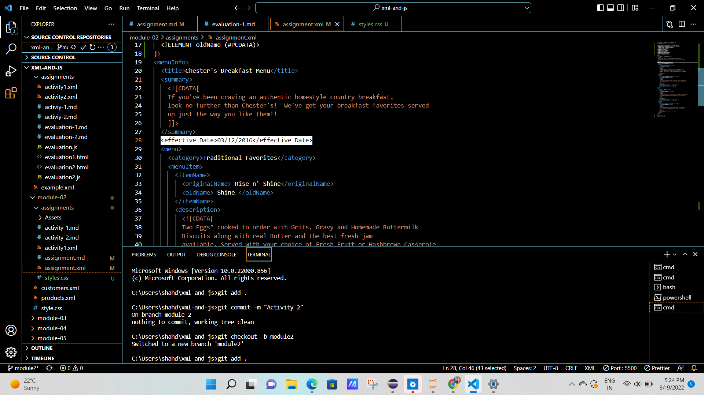
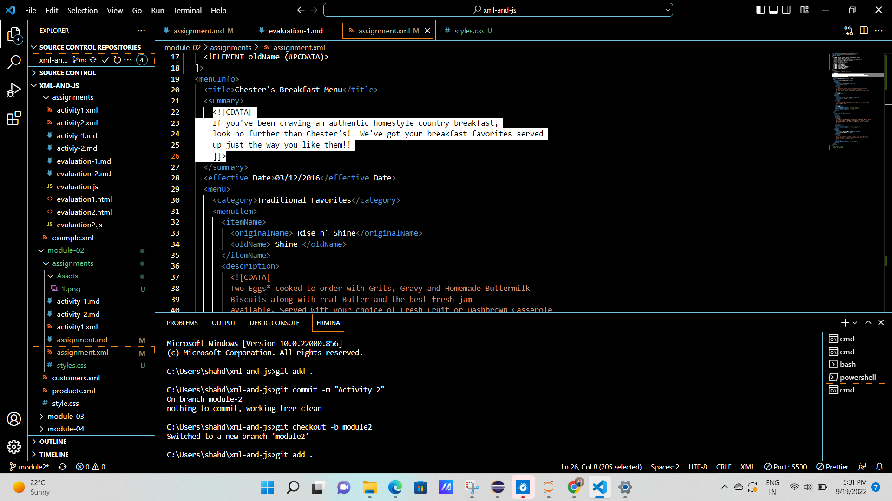
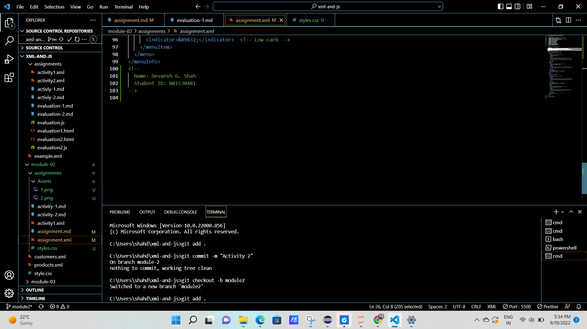
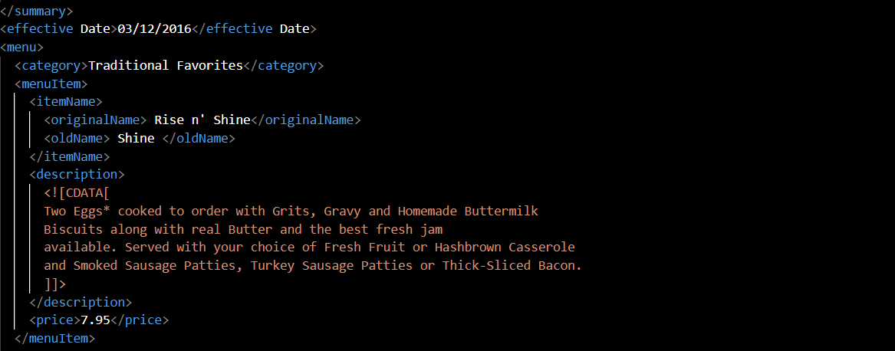
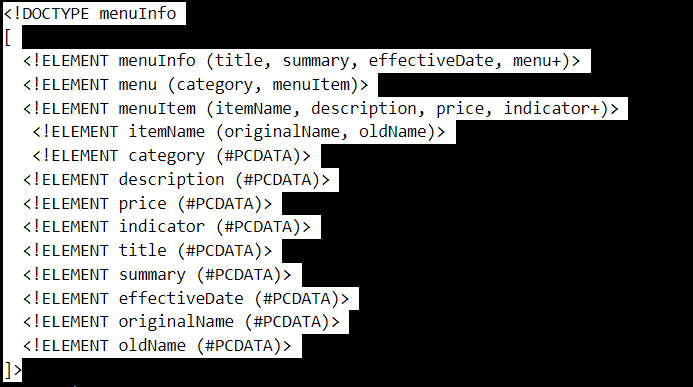
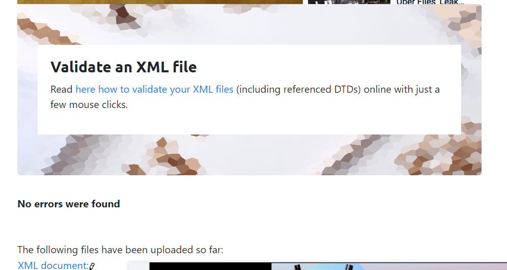
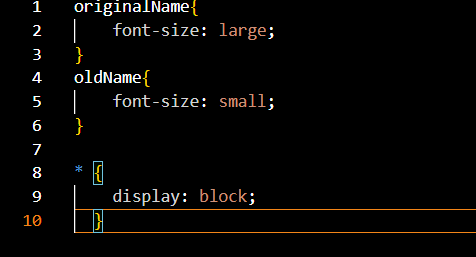

# Assignment 1

1. Open `module-2/assignments/assignment.xml` in your browser. Are there any errors? Explain the error and fix it.

Ans1: There is a error in the line 28. There is a space between element name. According to the rules, elements name can't contain any white space. 

2. What is the use of CDATA block in this document?

Ans2: In this document the CDATA block is used to provide the summary and the description of the main items of 
Chester's Breakfast Menu.
For example, how the particular dish is made and how it is served.

3. Add comment line to the end of file which contains you name and student id.

4. Identify prolog, document body, and epilog in the document. Are there any processing instructions?
Prolog: 
Document body: 
Processing Inst: 

5. Add inline DTD for this document.

6. Verify that file is well-formed and valid.

7. Create `style.css` file and link it to the file. Add the following styles to the .css:

- Change font-size of `originalName`
- Display each `category` on the new line
- Add any other css-rule

