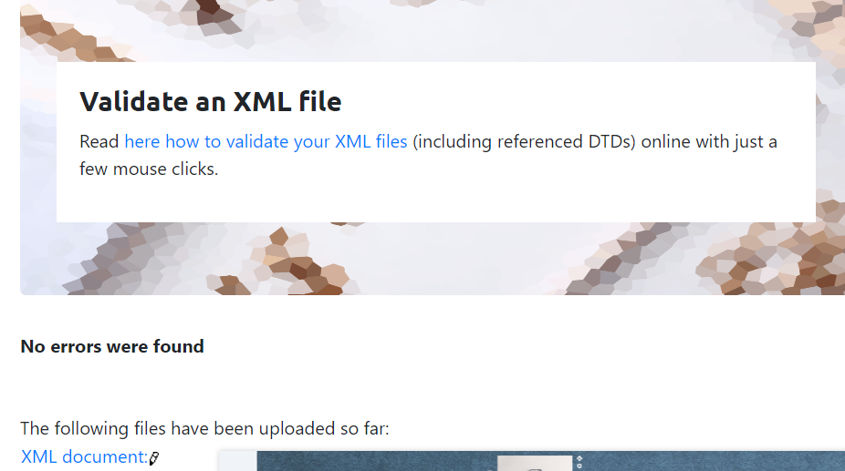
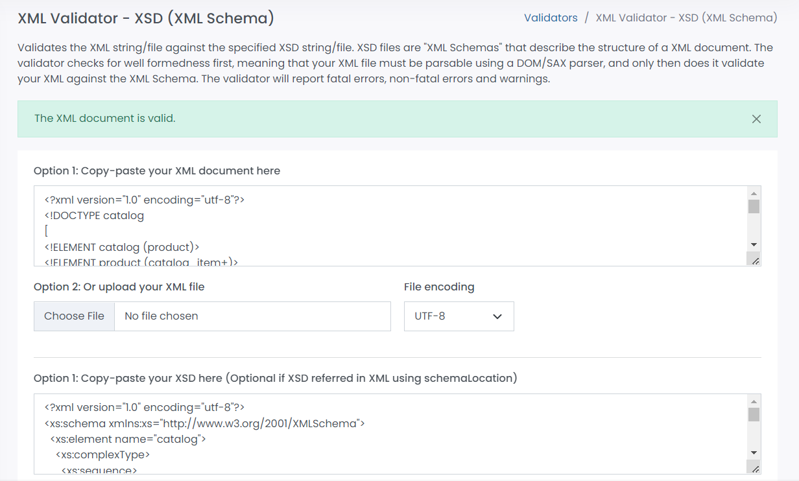

# Assignment 2

2. Create DTD for this file and validate it using any of the tools we used.

3. Create XSD for this file and validate it using any of the tools we used

4. Explain your thought process for these 2 declarations
Answer: According to me, the XSD code is easy to read and implement in compare to the DTD code.
