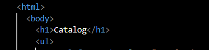
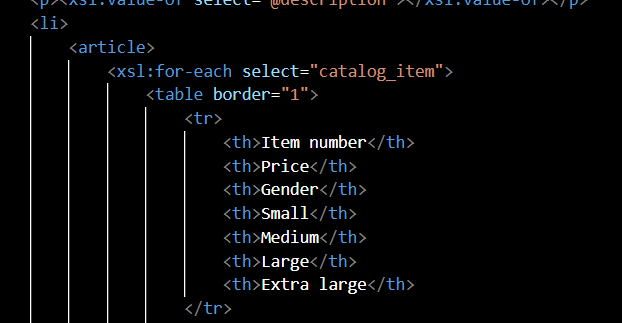
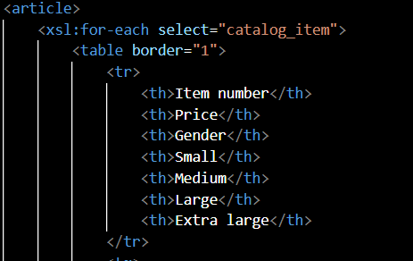
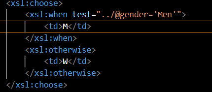
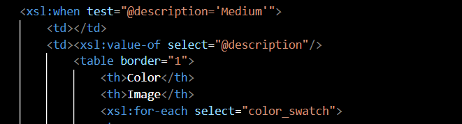
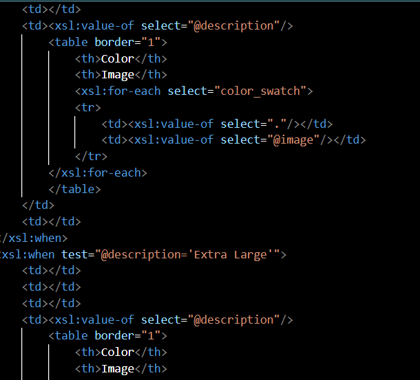

# Assignment 

1 - main title is "Catalog"

2 - use html list tag to display catalog

3 - render each item as `<article>` inside list item tag

4 - display product id as h3

 5- display product description as paragraph

6 - render table of catalog items with columns: item number, price, gender, small, medium, large, extra large (if column item is not present in item, then display empty cell)

7 - for gender column render M for Men, W for Women

 8- inside size columns (small, medium, large, and extra large) display subtable with 2 columns: color and image

